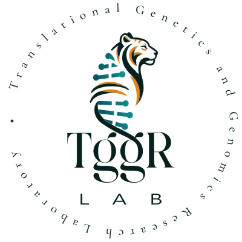

# TGGR Lab logo kit

The TGGR Lab logo, animated and static, ready to drop into another page or project. This file is written so it can be handed to another person or coding agent as the whole brief.

The approved animation is **the ring turns**: the lockup (tiger, helix, "TggR LAB") stays still while the ring of text, *Translational Genetics and Genomics Research Laboratory*, turns once every 80 seconds. It pauses under the pointer and stops for readers who ask for reduced motion. Use it unless there is a reason not to.

Open `demo.html` to see every variant in light and dark.

## Which file to use

| Where it goes | Use | Notes |
|---|---|---|
| A web page you control | `tggr-logo.js` + `assets/` | `<tggr-logo>` element. Follows the page's light/dark toggle. |
| A web page, one file only (React, Next, Vue, an artifact, a CMS) | `tggr-logo.standalone.js` | Same element, layers inlined. 480 KB, about 300 KB gzipped. |
| A GitHub README, Markdown, an email, anywhere without script | `tggr-logo.svg` | Turns on its own. Picks light or dark from the viewer's system setting. |
| A known light or dark background | `tggr-logo-light.svg`, `tggr-logo-dark.svg` | Fixed colours. Same animation. |
| Slides, documents, social images, print | `png/tggr-logo-{light,dark}-{512,1024}.png` | Still, transparent background. |
| A small spot (header, nav, avatar) | `<tggr-logo ring="none">` or `png/lockup-{light,dark}.png` | The ring text is unreadable below about 160 px wide. |

"light" means *for a light background* (dark ink). "dark" means *for a dark background* (cream ink).

## The element

```html
<script src="/path/to/tggr-logo.js"></script>

<tggr-logo></tggr-logo>                                   <!-- the ring turns -->
<tggr-logo style="width: 200px"></tggr-logo>               <!-- size with CSS width; height follows -->
<tggr-logo ring="none" style="width: 48px"></tggr-logo>    <!-- lockup only, 600:962 -->
<tggr-logo motion="drawn"></tggr-logo>                     <!-- drawn on once, then turns -->
```

Load the script once, anywhere on the page. `tggr-logo.js` looks for its PNGs in `assets/` next to itself; to put them elsewhere, set `assets="/img/tggr/"` on the element or `window.TGGR_LOGO_ASSETS = "/img/tggr/"` before the script. The standalone build needs nothing else.

| Attribute | Values | Default |
|---|---|---|
| `motion` | `turn` · `rungs` · `drawn` · `pointer` · `unzip` · `scroll` · `still` | `turn` |
| `ring` | `text` · `double` · `band` · `none` | `text` |
| `theme` | `auto` · `light` · `dark` | `auto` |
| `period` | seconds per revolution | `80` |
| `label` | accessible name | `TGGR Lab` |
| `assets` | folder holding the PNG layers | `assets/` beside the script |

Motions, numbered as on the options page the lab chose from (`../mockups/logo-motion.html`):

| | Markup | What moves |
|---|---|---|
| 1 | `<tggr-logo>` | **The chosen one.** The ring turns, pauses under the pointer. |
| 2 | `ring="double"` | Two rings turning against each other; the inner one names the Genetics Institute, Sourasky and TAU. |
| 3 | `motion="rungs"` | The teal base pairs brighten in a wave down the helix. The ring still turns. |
| 4 | `motion="drawn"` | Ink, then stripes, then rungs draw on when the logo first scrolls into view, then the ring fades in and turns. `el.replay()` runs it again. |
| 5 | `motion="pointer"` | The three colour layers shift at different depths with the pointer; the lockup breathes. |
| 6 | `motion="unzip"` | On hover the rungs pull out one way and the stripes the other. |
| 7 | `motion="scroll"` | The ring turns only when the page scrolls. |
| 8 | `ring="band"` | The solid teal band from the official logo turns. |
| 9 | `ring="band" motion="rungs"` | 8 and 3 together. |

**Theme.** With `theme="auto"` the element reads, in order: `<html data-theme="dark|light">`, then `<html class="dark">` (Tailwind's convention), then the system setting, and updates live when any of them changes. If the page has some other theme switch, set `theme="light"` or `theme="dark"` on the element from that switch.

**Colours.** The ring text uses `--tggr-ink` (`#15302e`) on light and `--tggr-ink-dark` (`#ece6d6`) on dark; the inner ring of `ring="double"` uses `--tggr-ink-2` / `--tggr-ink-2-dark`. Set them on the element or any ancestor to match a page's text colour. The lockup's teal and orange are fixed.

**Behaviour.** No fonts to load: the ring text is drawn as outlines of Cormorant Garamond 500, positioned exactly as the browser lays out the original text. All animation stops under `prefers-reduced-motion: reduce` (the `drawn` variant shows the finished logo), and pauses while the logo is off screen. The element has `role="img"` and an `aria-label`; everything inside is hidden from assistive technology.

**Frameworks.** It is a standard custom element, so it works as plain markup in React, Vue, Svelte or Astro. Load the standalone script from your `public/` folder with a `<script>` tag, or `import './tggr-logo.standalone.js'` in a client-side entry. In React 18 and earlier, pass attributes as strings: `<tggr-logo motion="drawn" />`. With server rendering, the element renders empty on the server and fills in on the client; give it its width in CSS so the layout does not shift.

## The plain SVG

```html

```

For a GitHub README, where the theme should follow GitHub's own setting, use the fixed files:

```html
<picture>
  <source media="(prefers-color-scheme: dark)" srcset="tggr-logo-dark.svg">
  
</picture>
```

## Geometry

Everything sits on a 400 × 400 square.

- Ring text: radius 180, Cormorant Garamond 500 at 21 units, spread evenly over 1030 of the 1131-unit circumference, starting at 9 o'clock and running clockwise. The 101-unit gap is centred on 9 o'clock with a dot of radius 2.4 in its middle.
- Lockup: 44.4% of the square's width (177.6 units), aspect 600 : 962, horizontally centred, its centre 1.5% of its own height above the square's centre. These were measured from the official ring file.
- Band variant: the lockup at 43% and exactly centred, as in the official band file.
- Double ring: outer radius 186 at 17 units, inner radius 152 at 14 units, lockup at 38%.

## Palette

| | Light background | Dark background |
|---|---|---|
| Page | `#f7f3ea` | `#0f1f1e` |
| Ring text, body text | `#15302e` | `#ece6d6` |
| Secondary text | `#5a6b68` | `#a9b3ae` |
| Lockup ink | `#05201d` | `#ece6d6` |
| Logo teal (rungs) | `#087679` | same |
| Logo orange (stripes) | `#da8517` | same |
| Band teal | `#18636d` | drawn 1.55× brighter |
| Teal for links and UI | `#1f8f92` | `#4fc0c6` |
| Orange for UI | `#d47a18` (`#b8650f` for small text) | `#f0a040` |

## Do and don't

- Do put it straight on the page colour. It needs no white disc or box behind it; on dark pages the ink is cream.
- Do keep the lockup and ring together at the measured proportions, or use the lockup alone. Don't move the lockup off centre, scale it separately, or stretch either.
- Don't recolour the teal or orange, and don't set the ring in another typeface.
- Don't speed the ring up. 80 seconds a revolution reads as still at a glance; much faster draws the eye away from the page.
- One moving logo per page. Use `motion="still"` or the lockup for any repeat (footer, sidebar).
- Below about 160 px wide, use `ring="none"` or the lockup PNG.

## Files

```
tggr-logo.js              web component (loads assets/)
tggr-logo.standalone.js   web component, all layers inlined
tggr-logo.svg             animated, light or dark by system setting
tggr-logo-light.svg       animated, for light backgrounds
tggr-logo-dark.svg        animated, for dark backgrounds
png/                      still renders, transparent: full logo at 512 and 1024, lockup at 600 × 962
assets/                   the layers: lock-ink, lock-ink-dark, lock-teal, lock-orange (600 × 962),
                          band (640 × 640), lockup (the official file)
demo.html                 every variant, with a light/dark switch
src/tggr-logo.src.js      source of the element
src/ring-paths.json       the ring text as SVG outlines
build.py                  rebuilds the five files at the top from src/ and assets/
```

To change the element, edit `src/tggr-logo.src.js` and run `python3 build.py` (Python 3, standard library only). The layer PNGs were cut from the official logo files the lab supplied; to change the artwork, replace them at the same size and position and rebuild.
